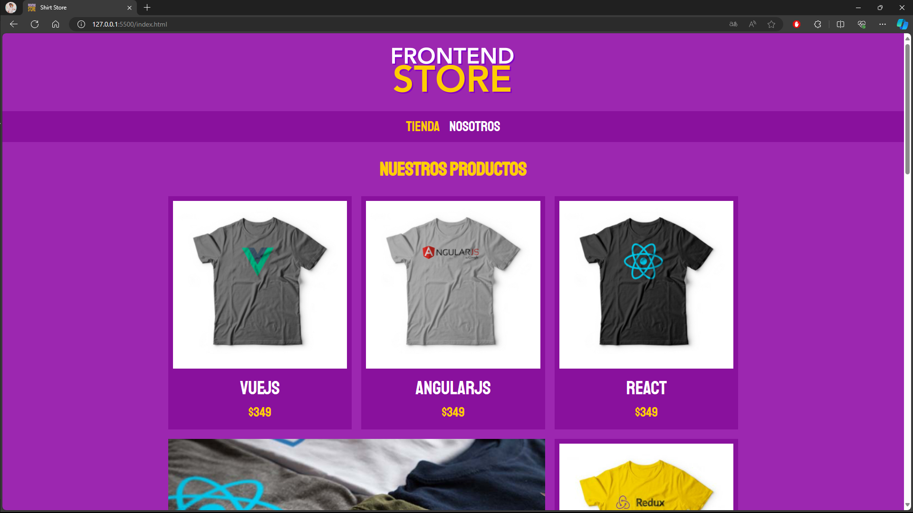
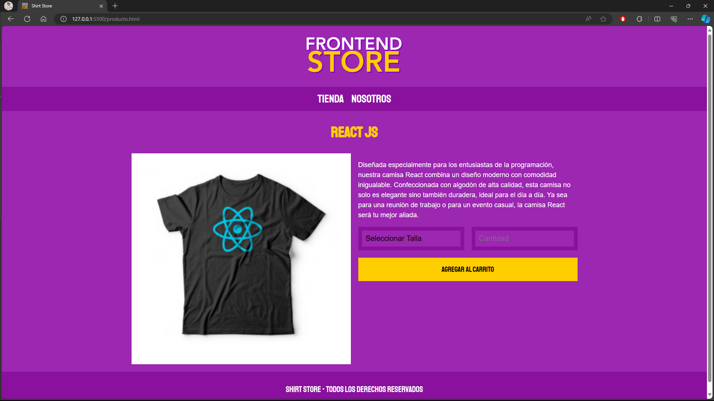

# Shirt Store

## Descripción
Shirt Store es una tienda online de camisas inspiradas en tecnologías de programación. Con una variedad de diseños que representan diferentes lenguajes y herramientas de desarrollo, ofrecemos productos de calidad a precios accesibles.

## Características
- Diseño responsivo
- Catálogo de camisas con imágenes y precios
- Navegación fácil y clara

## Tecnologías Utilizadas
- HTML
- CSS
- Normalize.css
- Google Fonts

## Aprendizaje
Este proyecto me sirvió para practicar y aprender más sobre el uso de CSS Grid para el diseño responsivo de la página.

## Cómo utilizar
1. Clona el repositorio:
    ```bash
    git clone https://github.com/LuisMariscalDev/store.git
    ```
2. Abre el archivo `index.html` en tu navegador web.

## Capturas de Pantalla



---

